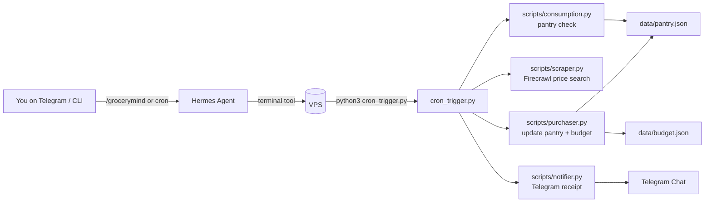

# GroceryMind 🧺

An autonomous pantry and grocery budget agent that runs on a VPS and is orchestrated by the [Hermes Agent](https://github.com/NousResearch/hermes-agent).

GroceryMind:

- Tracks your pantry inventory and predicts when items will run out.
- Looks up (or estimates) prices at multiple grocery stores.
- Updates a simple monthly budget file.
- Sends you a Telegram receipt after each run.
- Can be triggered manually or on a schedule via Hermes cron.

📹 **Demo video:** [`GroceryMind + Hermes walkthrough`](https://youtu.be/5fz-7NJOctY)

---

## Project Structure

- `cron_trigger.py` – main entrypoint; orchestrates a full GroceryMind run.
- `data/pantry.json` – current pantry inventory and consumption data.
- `data/budget.json` – monthly grocery budget and transaction history.
- `scripts/consumption.py` – computes `days_left` per item and flags low/critical stock.
- `scripts/scraper.py` – calls Firecrawl to search store websites and estimate prices.
- `scripts/purchaser.py` – "mock" purchases: updates pantry + budget JSON files.
- `scripts/notifier.py` – sends a Telegram receipt with what was (auto-)purchased.

---

## Architecture Diagram



---

## How It Works

1. **Pantry check**
   - `scripts/consumption.calculate_days_left()` loads `data/pantry.json`.
   - For each item, it computes:
     \[
     \text{days\_left} = \frac{\text{quantity}}{\text{daily\_consumption}}
     \]
   - Items are labeled:
     - 🔴 CRITICAL – `days_left <= 1`
     - 🟡 LOW – `days_left <= threshold_days`
     - 🟢 OK – otherwise
   - All CRITICAL/LOW items are returned as the "to buy" list.

2. **Best price search**
   - For each low item, `scripts/scraper.search_price()`:
     - Builds a search URL for Rewe, Aldi, and Lidl.
     - Calls the Firecrawl API with an extraction prompt:
       > Find the price of {item} in euros. Return only the lowest price as a number.
     - Parses the response and picks the cheapest store.
     - If scraping fails, it falls back to a random "mock" price so the demo still works.

3. **Mock purchase + budget update**
   - `scripts/purchaser.mock_purchase()`:
     - Updates the pantry:
       - Restocks the item to 14 days of consumption.
       - Updates `quantity`, `days_left`, and `preferred_store`.
     - Updates the budget in `data/budget.json`:
       - Increments `spent_this_month`.
       - Recomputes `remaining`.
       - Appends a transaction with `auto_purchased: true`.

4. **Telegram receipt**
   - `scripts/notifier.notify()` formats a Markdown message with:
     - Each purchased item, price, and store.
     - Total spent in this run.
     - Remaining monthly budget.
   - Sends it to your configured Telegram chat via `python-telegram-bot`.

5. **Orchestration**
   - `cron_trigger.run_grocery_check()` ties everything together:
     - Step 1 – pantry check.
     - Step 2 – best prices.
     - Step 3 – mock purchases.
     - Step 4 – Telegram notification + summary.

---

## Prerequisites

On the VPS where you run GroceryMind:

- Python 3.10+ with:
  - `requests`
  - `python-dotenv`
  - `python-telegram-bot`
- [Hermes Agent](https://github.com/NousResearch/hermes-agent) installed and configured.
- API keys and tokens stored in `~/.hermes/.env`:
  - `OPENROUTER_API_KEY` (or other LLM provider key for Hermes)
  - `FIRECRAWL_API_KEY`
  - `TELEGRAM_BOT_TOKEN`
  - `TELEGRAM_ALLOWED_USERS` (comma-separated Telegram user IDs)

**Important:** The project root `/root/grocerymind` also has a local `.env`, but it is **not** committed to git and should never contain secrets for this public repo.

---

## Running Locally on the VPS

From the VPS shell:

```bash
cd /root/grocerymind
python3 cron_trigger.py
```

This will:

- Print a step-by-step log in the terminal.
- Update `data/pantry.json` and `data/budget.json`.
- Attempt to send a Telegram notification if env vars are configured.

You can also test individual components:

```bash
python3 scripts/consumption.py   # show pantry status + low items
python3 scripts/scraper.py       # test price scraping for "milk"
python3 scripts/purchaser.py     # test a single mock purchase
python3 scripts/notifier.py      # send a sample Telegram receipt
```

---

## Integrating with Hermes Agent

Hermes runs on the same VPS and manages:

- Terminal commands (to run `python3 cron_trigger.py`).
- Secrets in `~/.hermes/.env`.
- Messaging gateways (Telegram, Discord, Slack, WhatsApp).
- A built-in cron scheduler.

### 1. GroceryMind as a Hermes skill

A `grocerymind` skill can:

- Explain what this project does.
- Run `python3 /root/grocerymind/cron_trigger.py` on demand.
- Summarize what was purchased and the remaining budget after each run.

Once installed, you can simply type:

```text
/grocerymind
Run GroceryMind now.
```

from within Hermes (CLI or Telegram), and the agent will call the terminal tool to execute the script.

### 2. Scheduling via Hermes cron

Inside a Hermes chat:

```text
/cron add "0 8 * * *" "Run python3 /root/grocerymind/cron_trigger.py and then summarize what was purchased and the remaining budget."
```

Hermes' gateway + cron scheduler will:

- Run GroceryMind every morning at 08:00.
- Deliver the summary to your chosen "home" channel (e.g. Telegram).

Make sure the gateway is running:

```bash
hermes gateway install   # once, to install as a service
hermes gateway start     # start the service
```

---

## Customizing for Your Household

- **Pantry items** – Edit `data/pantry.json` to add or adjust items:
  - `daily_consumption` should reflect your real usage.
  - `threshold_days` controls when an item is considered "low".
  - `avg_price` and `preferred_store` act as fallbacks when scraping fails.
- **Budget** – Edit `data/budget.json`:
  - Change `monthly_budget` to match your real budget.
  - Reset `spent_this_month`, `remaining`, and `transactions` as needed.
- **Safety rails** – A recommended future improvement:
  - Add a max spend per run (e.g. don't auto-purchase if the run exceeds a threshold, just notify instead).
  - Add a "dry run" flag so you can simulate purchases without mutating the JSON files.

---

## Disclaimer

GroceryMind is a demo / experimental project:

- It uses Firecrawl and simple heuristics to guess prices from store websites.
- It performs "mock" purchases by updating JSON files; it does **not** place real orders.
- Always review Telegram receipts and JSON updates before relying on it for real budgeting.

